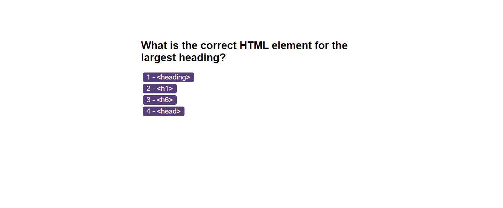

# coding-quiz

## Description

This is multiple choice quiz that uses Javascript to update the HTML and CSS dynamically. The quiz's features include:
* A time function that counts down in seconds
* 5 questions that display one at a time with four choices each
* A 10 second penalty taking off the timer in response to wrong answers
* Feedback to the user regarding whether their answer was correct or incorrect both on screen and using
* The ability for users to enter their initials and save their score to local storage

## Screenshot

## Link to deployed website

https://ffionerin.github.io/coding-quiz/
